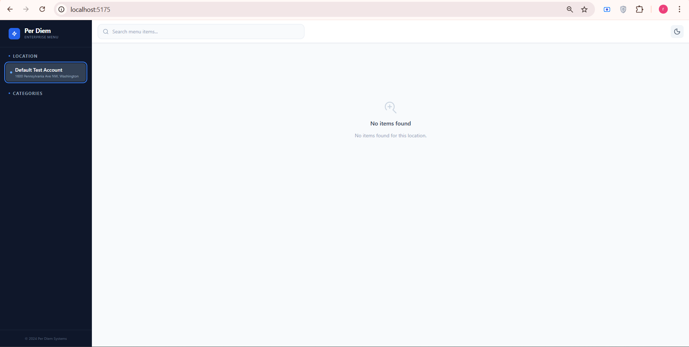

# Per Diem — Restaurant Menu Application

> Full-stack restaurant menu web app connecting to the Square Catalog API.
> Built for the Per Diem Engineering Challenge (February 2025).

## 🎯 Overview

A mobile-first web application that displays restaurant menu items from Square POS, with location filtering, category navigation, search functionality, and dark mode support.

## ✨ Features

### Backend (`server/`)
- Secure Square API proxy (token never exposed to frontend)
- Three RESTful endpoints: locations, catalog, categories
- In-memory caching with 5-minute TTL
- Transparent pagination handling
- Comprehensive error handling with typed responses
- Structured JSON request logging
- Full TypeScript implementation

### Frontend (`client/`)
- Mobile-first responsive design (optimized for 375px)
- **Dark mode toggle** with system preference detection
- Location selector with localStorage persistence
- Category navigation with smooth scrolling
- Client-side search by name/description
- Loading skeletons and error states
- React Query for data fetching and caching
- Tailwind CSS with custom design system
- **Comprehensive accessibility features**:
  - ARIA labels and roles
  - Keyboard navigation support
  - Screen reader friendly
  - Focus management
  - Semantic HTML

## 📁 Monorepo Structure

```
perdiem-monorepo/
├── client/                       # React + Vite frontend
│   ├── src/
│   │   ├── api/                  # Axios client
│   │   ├── components/           # React components
│   │   ├── contexts/             # Theme context
│   │   ├── hooks/                # React Query hooks
│   │   ├── mocks/                # Static demo data
│   │   ├── types/                # TypeScript interfaces
│   │   ├── __tests__/            # Vitest tests
│   │   └── App.tsx               # Main app component
│   ├── .env.example
│   ├── Dockerfile
│   ├── package.json
│   ├── vite.config.ts
│   └── tailwind.config.js
│
├── server/                       # Express + TypeScript backend
│   ├── src/
│   │   ├── config/               # Environment configuration
│   │   ├── middleware/           # Error handling, logging
│   │   ├── services/             # Square API integration
│   │   ├── types/                # TypeScript interfaces
│   │   ├── __tests__/            # Jest tests
│   │   └── server.ts             # Express app & routes
│   ├── .env.example
│   ├── Dockerfile
│   ├── package.json
│   └── tsconfig.json
│
├── docker-compose.yml            # Docker orchestration
├── package.json                  # Root package.json (monorepo)
└── README.md                     # This file
```

## 🚀 Quick Start

### Prerequisites
- Node.js 18+ and npm
- Square Developer account (free at https://developer.squareup.com)
- Docker (optional, for containerized deployment)

### Option 1: Monorepo Development (Recommended)

```bash
# 1. Install root dependencies
npm install

# 2. Install all workspace dependencies
npm run install:all

# 3. Set up environment variables
cp .env.example .env
# Edit .env and add your SQUARE_ACCESS_TOKEN

# 4. Start both frontend and backend together
npm run dev

# Access the app:
# - Frontend: http://localhost:5175
# - Backend API: http://localhost:3002
```

### Option 2: Docker

```bash
# 1. Set up environment variables
cp .env.example .env
# Edit .env and add your SQUARE_ACCESS_TOKEN

# 2. Start everything with Docker
npm run docker:dev

# Access the app:
# - Frontend: http://localhost:5175
# - Backend API: http://localhost:3002
```

### Option 3: Manual (Separate Terminals)

```bash
# Terminal 1 — Backend
cd server
npm install
npm run dev                 # → http://localhost:3002

# Terminal 2 — Frontend
cd client
npm install
npm run dev                 # → http://localhost:5175

# Note: Environment variables are read from root .env file
```

## 📜 Available Scripts

### Root Level (Monorepo)

```bash
# Development
npm run dev              # Start both client and server concurrently
npm run dev:server       # Start only backend
npm run dev:client       # Start only frontend

# Building
npm run build            # Build frontend for production
npm run build:server     # Build backend for production
npm run build:all        # Build both frontend and backend

# Production
npm start                # Start backend in production mode

# Testing
npm test                 # Run all tests (backend + frontend)
npm run test:server      # Run backend tests only
npm run test:client      # Run frontend tests only

# Utilities
npm run install:all      # Install dependencies for all workspaces
npm run clean            # Remove all node_modules and dist folders
npm run lint             # Run linter on frontend

# Docker
npm run docker:dev       # Start with docker-compose
npm run docker:down      # Stop docker containers
```

### Client Workspace

```bash
cd client
npm run dev              # Start Vite dev server
npm run build            # Build for production
npm test                 # Run Vitest tests
npm run lint             # Run ESLint
```

### Server Workspace

```bash
cd server
npm run dev              # Start with ts-node-dev (hot reload)
npm run build            # Compile TypeScript
npm start                # Start compiled server
npm test                 # Run Jest tests
```

## 🧪 Running Tests

```bash
# Run all tests
npm test

# Run backend tests only
npm run test:server

# Run frontend tests only
npm run test:client
```

**Test Results:**
- Backend: ✅ 20 tests passing (integration & unit)
- Frontend: ✅ Component tests for MenuGrid, MenuItemCard, SearchBar

## 🔧 Configuration

### Environment Variables

All environment variables are now managed in a single `.env` file at the root of the project.

```bash
# Copy the example file
cp .env.example .env

# Edit with your Square credentials
```

**Required Variables:**

```bash
# Square API Configuration
SQUARE_ACCESS_TOKEN=your_square_sandbox_or_production_token
SQUARE_ENVIRONMENT=sandbox  # or 'production'
SQUARE_APPLICATION_ID=your_square_application_id

# Server Configuration
PORT=3002

# Client Configuration (Vite)
VITE_USE_MOCK_DATA=false  # Set to 'true' for offline development
VITE_API_BASE_URL=/api    # API base URL (proxied by Vite in dev)
```

For Vercel deployment, see [VERCEL_DEPLOYMENT.md](VERCEL_DEPLOYMENT.md) for detailed instructions on setting environment variables.

## 🌐 API Endpoints

### GET /api/locations
Returns all active Square locations.

**Response:**
```json
[
  {
    "id": "L1234",
    "name": "Downtown Location",
    "address": "123 Main St, New York",
    "timezone": "America/New_York",
    "status": "ACTIVE"
  }
]
```

### GET /api/catalog?location_id={id}
Returns menu items grouped by category for a specific location.

### GET /api/catalog/categories?location_id={id}
Returns category summaries with item counts.

## 🏗️ Architecture Decisions

### Monorepo Structure
- **npm workspaces**: Native npm support for monorepos
- **Concurrently**: Run multiple npm scripts simultaneously
- **Shared root**: Single `package.json` for common dev dependencies
- **Isolated dependencies**: Each workspace maintains its own dependencies

### Backend
- **Express**: Lightweight, flexible, well-documented
- **TypeScript**: Type safety, better DX, catches errors early
- **NodeCache**: Simple in-memory caching, no external dependencies
- **Cursor-based pagination**: Handles large catalogs transparently

### Frontend
- **React + Vite**: Fast dev experience, modern tooling
- **React Query**: Declarative data fetching, automatic caching
- **Tailwind CSS**: Rapid UI development, consistent design
- **Dark Mode**: System preference detection with manual toggle
- **Accessibility**: WCAG compliant with ARIA labels and keyboard navigation

## 🚢 Production Deployment

### Vercel Deployment (Recommended)

This project is optimized for Vercel deployment with serverless functions. See the comprehensive [Vercel Deployment Guide](VERCEL_DEPLOYMENT.md) for detailed instructions.

Quick steps:
1. Set environment variables in Vercel dashboard (see `.env.example`)
2. Connect your Git repository to Vercel
3. Deploy with automatic builds on push

### Build for Production

```bash
# Build both frontend and backend
npm run build:all

# Or build separately
npm run build:server  # Compiles TypeScript to dist/
npm run build        # Builds frontend to client/dist/
```

### Deploy Backend

The backend can be deployed to:
- **Vercel**: Serverless functions (recommended, see [VERCEL_DEPLOYMENT.md](VERCEL_DEPLOYMENT.md))
- **Railway**: Node.js support, automatic HTTPS
- **Render**: Free tier available
- **Heroku**: Classic PaaS
- **AWS/GCP/Azure**: Full control

### Deploy Frontend

The frontend can be deployed to:
- **Vercel**: Optimized for Vite/React (recommended)
- **Netlify**: Easy static hosting
- **Cloudflare Pages**: Fast global CDN

### Docker Production

```bash
# Use production docker-compose (if you create one)
docker-compose -f docker-compose.prod.yml up --build
```

## 🔒 Security

- Square access token never exposed to frontend
- CORS configured for allowed origins
- Environment variables for secrets
- Input validation on API endpoints
- Non-root Docker users (in production Dockerfiles)

## 📊 Performance

- In-memory caching (5-min TTL) reduces API calls
- React Query caching on frontend
- Pagination handling for large catalogs
- Code splitting ready (React.lazy)
- Gzip compression in production

## 🐛 Troubleshooting

### Frontend can't connect to backend
- Verify backend is running on port 3002
- Check Vite proxy configuration in `client/vite.config.ts`
- Inspect network tab in browser DevTools

### Backend Square API errors
- Verify `SQUARE_ACCESS_TOKEN` is valid in `server/.env`
- Ensure `SQUARE_ENVIRONMENT` matches your token type
- Check Square API logs in developer dashboard

### Monorepo issues
- Run `npm run clean` to remove all node_modules
- Run `npm run install:all` to reinstall everything
- Ensure you're using Node.js 18+

### Docker issues
- Ensure `.env` file exists in `server/`
- Check logs: `docker-compose logs -f`
- Verify ports 3002 and 5175 aren't in use

## 📝 Assumptions & Limitations

### Assumptions
- Single currency per location (USD formatting)
- First variation price shown as primary price
- Categories use name as ID for grouping
- Active locations only

### Limitations
- In-memory cache (doesn't persist across restarts)
- No real-time updates (5-min cache TTL)
- Client-side search only (no backend filtering)
- No authentication/authorization implemented

### Future Enhancements
- Redis for distributed caching
- Square webhooks for real-time updates
- Server-side search and filtering
- Rate limiting
- Analytics integration
- E2E tests with Playwright/Cypress

## 🤝 Development Workflow

### Adding a New Feature

1. **Backend changes**: Work in `server/src/`
2. **Frontend changes**: Work in `client/src/`
3. **Run dev mode**: `npm run dev` (watches both)
4. **Test**: `npm test`
5. **Build**: `npm run build:all`

### Working with Workspaces

```bash
# Install a package in client
npm install <package> --workspace=client

# Install a package in server
npm install <package> --workspace=server

# Run a script in specific workspace
npm run <script> --workspace=client
npm run <script> --workspace=server
```

## Screenshot


## 📄 License

This project is for evaluation purposes as part of the Per Diem coding challenge.

---

Built with ❤️ for Per Diem Engineering Challenge
